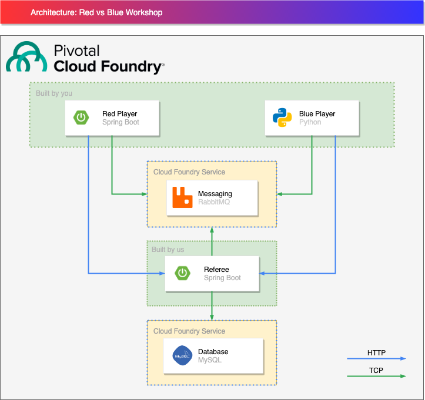
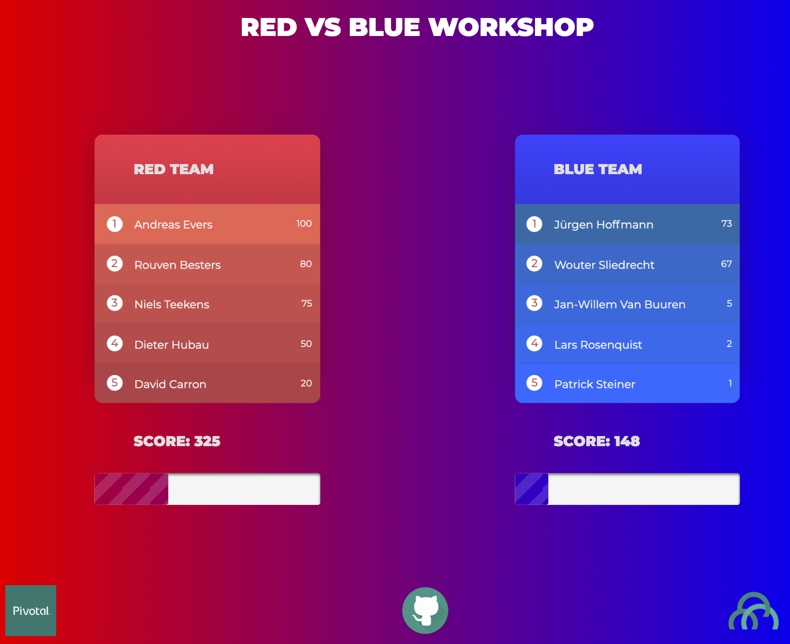

# Red vs Blue

Welcome to the Red vs Blue workshop illustrating the power of the Pivotal Platform!

# The Game

In this workshop, we will play a little game of throwing balls at each other.
This is how the workshop is technically set up:

As you can see, all the apps and services will be deployed and running on the Pivotal Platform.
Let's go over the different parts of the diagram.

# Referee

The referee has been created to act as sort of validator and score keeper in the Red vs Blue game.
The app validates teams throwing balls at each other by reading messages from the message broker, and registers the hits in the database.

The referee offers a UI to keep track of the top players and their scores.
It will simply update every second to show a realtime overview of the game.

The referee also offers an API that exposes player information and their scores.
You will need to consume this API to build your player app.

## Referee API

The referee API is generated by Spring REST Docs, a Spring library that generates REST API documentation during integration tests.
When the integration tests fail, the documentation is not generated.
This means that, if the integration tests are comprehensive enough and cover all the REST API codebase, the documentation will always be up-to-date with the actual API.

<<LINK TO REFEREE API>>

# Players

Players will be creating an application that can throw balls at players from the other team by sending messages over a message broker.
Each player is either in Team Red or Team Blue.

# Java Player

Read the instructions in the [java-player](/java-player/README.md) README.
When you get lost, check out the solution in [java-player-solution](/java-player-solution).

# Python Player

Read the instructions in the [python-player](/python-player/README.md) README.
When you get lost, check out the solution in [python-player-solution](/python-player-solution).